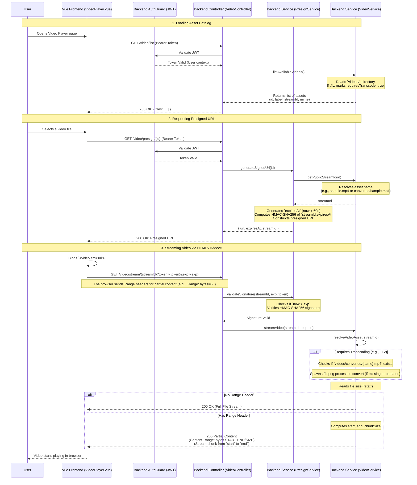

# Video Streaming Flow (Frontend & Backend)

The following sequence diagram illustrates the detailed flow of securely streaming a video asset from the backend to the frontend using JWT authentication, short-lived presigned URLs, and HTTP range requests.

## Key Technical Details

1. **Presigned URLs**: To avoid sending JWT tokens in HTML5 `<video>` requests (which by default don't support `Authorization` headers well across browsers without XHR blob buffering), we use temporary presigned URLs.
2. **HMAC Signature**: The backend generates a secure token for the URL using `crypto.createHmac('sha256', secret).update('streamId:expiresAt').digest('hex')`.
3. **HTTP 206 Partial Content**: The Fast/Seekable streaming is achieved through HTTP Range requests and byte-range fs streams (`fs.createReadStream(path, { start, end })`).
4. **On-the-fly Transcoding**: Unsupported web formats like `.flv` are detected and processed via `ffmpeg` into `.mp4` transparently before being streamed to the user.
